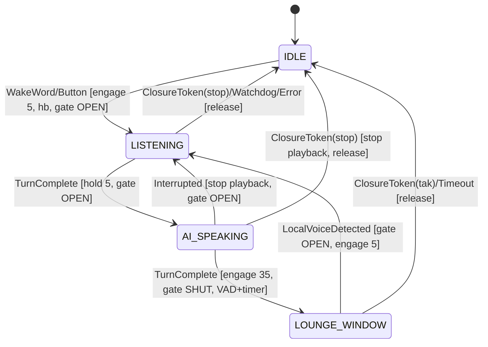

# PodVoice — Master Plan

> **HISTORICAL DOCUMENT (superseded 2026-07-02).** This was the original architecture
> plan. The project has since pivoted to **Track B — the thin client** (the model owns
> the conversation): see **docs/PLAN-BEAT-GEMINI.md** for the current plan, and
> CHANGELOG.md for what actually shipped. File references below (e.g. voice-pe.yaml)
> may describe deleted scaffolding.


> Standalone voice-AI gatekeeper for a PodConnect home, shipped as a **Home Assistant Add-on**.
> A custom-firmware HA Voice PE streams raw audio to PodVoice; PodVoice runs a full-duplex
> Gemini Live conversation and **ducks the room's music** through PodConnect's Attention API
> while the conversation is live.
>
> Repo: `github.com/BixelVentures/podvoice` · Host: HA Green (aarch64) · Language: Python 3.12 asyncio
>
> **This is a build bible.** It was assembled from focused research against current docs (mid-2026).
> Library APIs move fast — every literal version/model/method marked **VERIFY** must be re-confirmed
> against official docs at implementation time. Source URLs are cited inline throughout.

---

## Table of contents
- §0 Settled decisions
- §1 System context & architecture
- §2 Repository layout
- §3 State machine (overview) + canonical constants
- §4 Custom Voice PE firmware (`esphome/voice-pe.yaml`)
- §5 Gemini Live integration (`gemini.py`)
- §6 Voice PE runtime tap & HA Add-on packaging
- §7 State machine, Attention client & gatekeeper
- §8 Resilience, watchdog, barge-in & observability
- §9 Dependencies & versions
- §10 Security & secret handling
- §11 Testing & CI
- §12 Phased roadmap & milestones
- §13 Consolidated risk register
- §14 Glossary & references

---

## 0. Settled decisions (read this first)

These were open questions; they are now closed. The rest of the plan assumes them.

| Decision | Resolution | Why |
|---|---|---|
| **Project name** | **PodVoice** (the blueprint's "LiveBridge" alias is dropped) | User direction. |
| **Volume contract** | **PodConnect Attention API** (Speakers 0.14.0) at `http://<ha-host>:8099` | TTL/heartbeat **crash-safe** — a PodVoice crash can never leave music stuck quiet. Overrides the blueprint's "direct librespot/shairport" wording. |
| **Audio transport** | **Custom ESPHome firmware** streaming raw 16 kHz PCM over the ESPHome native API | Stock firmware only streams during a pipeline run; a continuous open stream requires forked firmware (see §4 — and note this is the project's #1 risk). |
| **Where PodVoice runs** | **HA Add-on** (own Docker container, supervised by HA, on the Green) | "HA-direct install, no extra server, easy maintenance" **and** its own failure domain so a Gemini/VAD hiccup can't take down HA or the music. Mirrors how PodConnect is deployed. |
| **Gemini model** | A **Live** model — `gemini-2.5-flash-native-audio-preview-12-2025` or `gemini-3.1-flash-live-preview` (**VERIFY** exact string) | The blueprint's `gemini-3.5-flash` is **not** a Live model. Native-audio chosen for Danish prosody; system-prompt drives Danish (native-audio ignores `language_code`). |

### Contract details corrected from the first sketch (per the shipped Attention API doc)
- Ducking is **instant** — `fade_ms` is accepted but **ignored** in v1. No fade animations.
- IDLE / barge-in is a **`/api/attention/release`** (restores the *pre-duck* level captured on first engage) — **not** a hard "set level 100".
- Attention is **per-room** → PodVoice needs a **Voice-PE → room-id** map in config.

### Vercel skill prompts
The session's hook auto-injects Vercel/Next.js skill suggestions (workflow, ai-sdk, ai-elements, etc.) from keyword matches. They are **false positives** — PodVoice is Python/ESPHome/HA, no Vercel. Ignore them.

---

## 1. System context & architecture

```
                         ┌─────────────────────────── HA Green (one box) ───────────────────────────┐
                         │                                                                            │
  [ HA Voice PE ]        │   [ Home Assistant core ]        [ Add-on: PodConnect ]   [ Add-on: PodVoice ]
  custom firmware  ──────┼──▶  (lights, shopping list,  ◀──── Spotify→AirPlay bridge      │   │   │
  • raw 16k PCM out      │      tool-bridge target)      │   + Attention API :8099  ◀──────┘   │   │
  • micro_wake_word      │            ▲                  │        (duck/release/heartbeat)      │   │
  • center button        │            │ supervisor token │                                      │   │
  • speaker (dialogue)   │            └──────────────────┼──── tool calls ─────────────────────┘   │
         ▲   │           │                               │                                          │
         │   └───────────┼───────────────────────────────────── ESPHome native API ───────────────┘
         │  audio out     │                                       (audio up + events + playback)
         │                └──────────────────────────────────────────────────────────────────────────┘
         │
   [ Apple HomePod ] ◀──── music (AirPlay 2, buffered) ──── PodConnect
```

**Audio routing (drives the gatekeeper design).** The Voice PE's hardware echo cancellation only
cancels its **own** speaker, never the HomePod. Therefore:
- **Dialogue** (Gemini's voice) → out the **Voice PE speaker** (low-latency).
- **Music** → out the **HomePod** (buffered AirPlay 2).
- The Voice PE mic still hears the HomePod, so we must never let ambient music corrupt Gemini's
  server VAD → hence the **0-byte gatekeeper** during LOUNGE_WINDOW (§5.4, §7.4).

**Failure domains.** Three independent processes on one box: HA core, PodConnect add-on, PodVoice
add-on. They meet only at (a) the Attention API and (b) the HA service API. If PodVoice dies, the
Attention TTL auto-restores music in ~2 s and HA is untouched.

---

## 2. Repository layout

```
podvoice/                          # the HA add-on (own folder so the repo can hold more later)
├── config.yaml                    # add-on manifest: options schema, arch, host_network, homeassistant_api
├── build.yaml                     # base image per arch (aarch64 base-python for HA Green)
├── Dockerfile                     # base image (explicit FROM) → pip install -r requirements.txt → entrypoint
├── requirements.txt               # pinned runtime deps (§9)
├── requirements-dev.txt           # test/lint deps (§9, §11)
├── run.sh                         # entrypoint: exec python -m gatekeeper (options read in Python)
├── icon.png / logo.png            # add-on store art
├── DOCS.md                        # user-facing add-on docs (install, config fields)
├── gatekeeper/                    # the Python service
│   ├── __init__.py
│   ├── __main__.py                # asyncio entrypoint, signal handling, supervised tasks
│   ├── config.py                  # load /data/options.json + SUPERVISOR_TOKEN
│   ├── state.py                   # the state machine
│   ├── voicepe.py                 # aioesphomeapi link: raw audio in, wake/button events, speaker out
│   ├── gemini.py                  # google-genai Live session
│   ├── gatekeeper.py              # the 0-byte gate (forward mic↔Gemini or not)
│   ├── podconnect.py              # Attention API client
│   ├── heartbeat.py              # the Attention heartbeat task
│   ├── watchdog.py                # 800 ms round-trip watchdog + error tone trigger
│   ├── ha_tools.py                # tool bridge: Gemini function-calls → HA services (supervisor token)
│   └── audio.py                   # PCM helpers: resample, energy/VAD, silence, error tone
└── tests/                         # pytest (§11)

esphome/
└── voice-pe.yaml                  # custom firmware (fork of the official Voice PE YAML)

repository.yaml                    # HA add-on repository descriptor (installable from the Store)
config.example.yaml                # standalone/dev run config (mirrors the add-on options schema)
README.md
PLAN.md                            # this file
.github/workflows/ci.yml           # lint + test + aarch64 build
```

> **PodConnect's `watchdog.sh` (named-pipe continuity) is NOT in this repo** — it belongs to the
> PodConnect add-on. PodVoice's only watchdog is the 800 ms latency abort in `watchdog.py`.

---

## 3. State machine (overview) + canonical constants

High-level table (full design, transitions, races, and sketches are in §7).

| State | Enter trigger | Attention call | Mic→Gemini gate | Speaker | Gemini WS |
|---|---|---|---|---|---|
| **IDLE** | startup / conversation closed | `release {room}` (music → pre-duck/100%) | closed | silent | **closed** |
| **LISTENING** | wake word **or** center-button | `attention {level:5, owner:"voice", ttl_ms:2000}` + ~500 ms heartbeat | **open** (raw PCM up) | silent | **open** |
| **AI_SPEAKING** | Gemini responding | hold `level:5`, keep heartbeat | open (for barge-in) | **Gemini audio out** | open |
| **LOUNGE_WINDOW** | Gemini `turn_complete` (6–8 s) | `attention {level:35, ttl_ms:8000}` | **shut (silence frames)** | silent | **held open** |

### Canonical operational constants (single source of truth)
These values are the spec. They appear as config options (§6) but these are the defaults everything
else must agree with:

| Constant | Value | Meaning |
|---|---|---|
| `duck_level` | **5** | HomePod % during LISTENING / AI_SPEAKING |
| `lounge_level` | **35** | HomePod % during LOUNGE_WINDOW |
| (IDLE) | release | restores pre-duck level |
| `ttl_ms` (listening) | **2000** | TTL while LISTENING/AI_SPEAKING |
| `ttl_ms` (lounge) | **8000** | TTL while LOUNGE_WINDOW |
| `heartbeat_ms` | **500** | re-POST cadence (4 beats per 2 s TTL) |
| `lounge_window_s` | **8** | follow-up window length |
| `watchdog_ms` | **800** | round-trip latency abort threshold |
| `vad_threshold` | ~**0.012–0.02** RMS | lounge energy gate (calibrated vs ambient) |
| `owner` | `"voice"` | Attention owner string |

---

## 4. Custom Voice PE firmware (`esphome/voice-pe.yaml`)

This is the **highest-risk area of PodVoice.** The Voice PE's stock firmware assumes *Home Assistant's
Assist pipeline* is the consumer of the mic and driver of the speaker. PodVoice inverts that: an
external `aioesphomeapi` client (the add-on) must be the *primary, continuous* consumer of raw mic
audio and the *primary* driver of dialogue playback, while wake-word and button events still reach us.
Nothing in the stock component graph does this out of the box, so this section is explicit about what
stock components give us free, where custom firmware is needed, and which questions can only be settled
by on-hardware spikes.

### 4.1 Strategy: fork the official YAML, strip and extend (do **not** write minimal)

**Recommendation: fork the official `home-assistant-voice.yaml` from the `dev` branch and modify it
surgically.** ([dev YAML](https://github.com/esphome/home-assistant-voice-pe/blob/dev/home-assistant-voice.yaml))
The board encodes a lot of hardware knowledge that's painful to reconstruct and almost none of it is
what we change:

- **i2s input (mics):** `i2s_input` LRCLK `GPIO14`, BCLK `GPIO13`, Din `GPIO15`; `i2s_mics`,
  `adc_type: external`, `pdm: false`, `sample_rate: 16000`, `bits_per_sample: 32bit`, `channel: stereo`.
  **VERIFY** pins against your board revision.
- **i2s output (speaker):** `i2s_output` LRCLK `GPIO7`, BCLK `GPIO8`, Dout `GPIO10`; `i2s_audio_speaker`
  **`sample_rate: 48000`**, 32-bit, stereo. The 48 kHz hardware rate is the crux of the playback
  resampling problem (§4.5).
- **LED ring** (12× WS2812 on `GPIO21`), **hardware mute** (`GPIO3`), **rotary encoder** (`GPIO16`/`GPIO18`,
  volume), **center button** (`GPIO0`, inverted).

**Keep verbatim:** pin definitions, i2s buses, LED stack, mute chain, rotary encoder.
**Change/add:** the mic data path (§4.2), wake-word handler (§4.3), button single-press (§4.4),
playback path (§4.5), API encryption ownership (§4.6, §4.8). Likely **neuter** the stock
`voice_assistant` HA-driven behavior (its `on_wake_word_detected` and single-press both *start HA
Assist* — exactly what PodVoice takes over).

A from-scratch minimal YAML would waste Phase 1 debugging i2s/LED config instead of the real hard
problem (continuous audio). Fork, then delete what you don't need.

### 4.2 CONTINUOUS raw audio — the core problem, and it is NOT free

**Verified constraint (load-bearing for the whole project):** the stock `voice_assistant` component
streams mic audio **only during an active pipeline run** (between a start request and run-end). From
the source ([voice_assistant.cpp](https://github.com/esphome/esphome/blob/dev/esphome/components/voice_assistant/voice_assistant.cpp)):
audio frames are only emitted in `STREAMING_MICROPHONE`; streaming halts on `VOICE_ASSISTANT_RUN_END`;
transport (API-native vs UDP) is chosen by which `start_streaming()` overload the client calls
(no-arg → `AUDIO_MODE_API`). **Single-consumer exclusivity is enforced in firmware** — a second client
triggers "Multiple API Clients attempting to connect to Voice Assistant." This lets PodVoice *own* the
subscription (§4.8) but means HA Assist and PodVoice cannot both hold it.

Client side ([aioesphomeapi client.py](https://github.com/esphome/aioesphomeapi/blob/main/aioesphomeapi/client.py),
[api.proto](https://github.com/esphome/esphome/blob/dev/esphome/components/api/api.proto)):
`subscribe_voice_assistant(..., handle_audio=...)` auto-sets `VOICE_ASSISTANT_SUBSCRIBE_API_AUDIO`;
`VoiceAssistantAudio` (msg 106) carries `data` / `end` / `data2` (two mic channels — processed vs
less-processed; **VERIFY** which is which, matters for AEC).

**Three candidate mechanisms, evaluated honestly:**

- **Option A — `voice_assistant.start_continuous` + re-arm.** Lowest effort, but "continuous" means
  *auto-restart after a response*, not *stream forever*; it still routes through the pipeline state
  machine, producing **gaps** exactly when the user stops talking. Fine for a Phase-1 plumbing spike,
  **not** the primary path.
- **Option C (leading candidate) — keep `voice_assistant` transport but neutralize gating.** Subscribe
  with API audio, call `start_streaming()` (API mode), and patch the firmware so it does **not** stop on
  VAD-end / run-end (hold `STREAMING_MICROPHONE`). Smallest fork; maximum reuse of battle-tested i2s
  capture + API framing.
- **Option B — custom mic consumer streaming unconditionally.** A custom component / `microphone.on_data`
  listener that pushes every frame independent of the VA state machine. The catch: there is **no stock
  generic "stream arbitrary bytes to a native-API client" message**, so B means either (B1) reuse the VA
  API-audio send path gated on our own flag, or (B2) a separate TCP/UDP side channel from a custom
  component to the add-on.

**Honest verdict:** no stock path is *confirmed* to stream gap-free continuous 16 kHz to an external
client; all are pipeline-coupled and the only continuous primitive is response-coupled. **This is a
known unknown that must be settled by a spike before the rest is built.**

> **Phase-1 Spike S1 (blocking, do first).**
> 1. Flash a fork with `api: encryption:` + a throwaway `aioesphomeapi` script that sets API audio and
>    calls `start_continuous`. Confirm `VoiceAssistantAudio` frames arrive; measure frame size, cadence,
>    and whether there are gaps during user silence (Option A reality check).
> 2. If gaps exist (expected), prototype Option C: hold `STREAMING_MICROPHONE`; re-measure for gap-free
>    16 kHz mono.
> 3. If C is impractical, prototype Option B (custom listener); decide B1 vs B2.
> **Exit:** sustained gap-free 16 kHz/16-bit/mono PCM at the add-on for >10 min, with mute (`GPIO3`)
> correctly zeroing/stopping the stream. Pick the mechanism, then build the rest of the firmware around it.

### 4.3 Wake word (`micro_wake_word`) → surfaced to PodVoice

Keep the stock `micro_wake_word` block but **rewrite `on_wake_word_detected`** to notify PodVoice
instead of starting HA Assist. ([micro_wake_word docs](https://esphome.io/components/micro_wake_word.html))
- **Models (dev YAML):** `okay_nabu`, `hey_jarvis`, `hey_mycroft`, and an `internal: true` **`stop`**
  model. The `stop` model is the **barge-in** primitive — keep it and route it to PodVoice as an
  interrupt signal.
- **Danish / "Hej Gemini":** no official Danish/"Hej Gemini" model exists as of now (**VERIFY**). Ship
  **`okay_nabu`** for Phase 1; a custom-trained microWakeWord model is a later, separate workstream.
- **How PodVoice sees it:** fire a **template `event` entity** (e.g. `event_types: [wake_okay_nabu,
  wake_stop]`) from the trigger lambda; PodVoice subscribes over the native API. Keep `vad:` enabled.

### 4.4 Center button single-press → explicit event

**Verified stock behavior:** `center_button` is `gpio` on `GPIO0` (`inverted`) with **no name** (internal).
Single-press → device control (stop / start Assist); double/triple/long → emitted via a template
`event` entity (`button_press_event`). Single-press is deliberately *not* on the event entity.
**Change:** in the single-press branch, **fire a new `single_press` event** PodVoice consumes, while
preserving the double/triple/long/factory-reset/easter-egg branches. **VERIFY** the single-press branch
is cleanly separable (we may keep the local "stop my own playback" half and only redirect the "start
Assist" half).

### 4.5 Speaker playback of Gemini's 24 kHz PCM — a second known unknown

Gemini Live output is **24 kHz PCM**; the Voice PE speaker hardware runs at **48 kHz**. Candidate paths:

- **Path 1 — `VoiceAssistantAnnounceRequest` (`send_voice_assistant_announcement_await_response`).**
  Expects a **media_id (URL)**, request/response oriented → latency-heavy, fights real-time streaming.
- **Path 2 — `media_player_command(media_url=…, announcement=True)`.** Also URL-based; PodVoice must
  serve audio over HTTP; device resamples to 48 kHz. High reuse, but buffered — **VERIFY** latency.
- **Path 3 (most promising) — feed a `speaker` component raw PCM from a custom component**, via a
  **resampler speaker (24 k → 48 k, a clean 2× upsample)** → the stock `mixer_speaker` →
  `i2s_audio_speaker`. Lowest latency, no HTTP, but needs custom firmware to accept a *streamed* feed.

There is also a verified low-level client method **`send_voice_assistant_audio(data: bytes)`** that
pushes raw bytes back over the active VA stream (§6 PART A) — the natural low-latency fit if the
firmware exposes the speaker on that path.

**AEC note:** AEC must cancel only the Voice PE's own dialogue output; whatever path we pick, the
played dialogue is the reference signal AEC needs. **VERIFY** where AEC runs (firmware vs add-on).

> **Phase-1 Spike S2 (blocking before playback design).** Prototype Path 3 (raw PCM → resampler →
> mixer → speaker) vs Path 2 (URL announce) on hardware. Measure mouth-to-ear latency + quality.
> **Exit:** <300 ms added latency, no underruns, AEC reference available, sustainable *alongside*
> continuous mic capture (watch the "too many audio components → crash" warning).

### 4.6 `api:` encryption (Noise PSK)

```yaml
api:
  id: api_id
  encryption:
    key: !secret podvoice_api_key   # 32-byte base64 Noise PSK; PodVoice connects with the same value
```
The PSK lives in the add-on config and ESPHome `secrets.yaml`; they must match.

### 4.7 Annotated YAML SKETCH (illustrative — NOT final; depends on S1/S2)

```yaml
# voice-pe.yaml — PodVoice fork of home-assistant-voice.yaml (dev). SKETCH ONLY. Pins VERIFY.
substitutions:
  name: podvoice-pe
# KEEP VERBATIM from official dev YAML: i2s_audio buses, microphone i2s_mics (16kHz/32bit/stereo),
#   speaker i2s_audio_speaker (48kHz) + resampler/mixer speakers, LED ring, mute switch, rotary encoder.

api:
  id: api_id
  encryption: { key: !secret podvoice_api_key }   # §4.6

micro_wake_word:                                   # §4.3 — redirect handler to PodVoice
  id: mww
  vad:
  models:
    - { model: github://esphome/micro-wake-word-models/models/v2/okay_nabu.json, id: okay_nabu }
    - { model: stop, id: stop, internal: true }    # barge-in
  on_wake_word_detected:
    - event.fire:                                  # VERIFY exact action for template event
        id: podvoice_event
        event_type: !lambda 'return (wake_word == "stop") ? "wake_stop" : "wake_okay_nabu";'

event:                                             # §4.3/§4.4 — what PodVoice subscribes to
  - platform: template
    id: podvoice_event
    name: "PodVoice event"
    device_class: button
    event_types: [single_press, double_press, triple_press, long_press, wake_okay_nabu, wake_stop]

binary_sensor:
  - platform: gpio
    id: center_button
    pin: { number: GPIO0, inverted: true }
    on_multi_click:                                # KEEP double/triple/long branches; redirect single:
      - timing: [ON for at most 1s, OFF for at least 0.25s]
        then: [ event.fire: { id: podvoice_event, event_type: single_press } ]   # §4.4

voice_assistant:                                   # §4.2 — mechanism chosen by Spike S1 (PLACEHOLDER)
  id: va
  microphone: { microphone: i2s_mics }             # VERIFY data/data2 channel mapping
  speaker: i2s_audio_speaker                        # OR mixer/resampler path per §4.5
  use_wake_word: false                              # PodVoice drives, not HA
  # Continuous gap-free streaming is NOT a stock option; actual approach (A/C/B) is a Phase-1 deliverable.
# external_components: [ ... ]                       # custom mic-streamer / pcm-sink if B/C
```

### 4.8 Flashing, iteration & keeping the subscription owned by PodVoice

- **Flashing:** ESPHome dashboard add-on in HA (or `esphome run`). First flash USB, then OTA. Fork lives
  in `esphome/voice-pe.yaml` with `secrets.yaml` holding `podvoice_api_key`.
- **Subscription ownership (critical):** firmware enforces single-client VA exclusivity. To keep PodVoice
  the owner: (1) **do not add this device to HA's Assist** (no pipeline assigned); (2) PodVoice connects
  with the PSK and claims the VA audio subscription; (3) **VERIFY on hardware** that HA's normal ESPHome
  integration connection doesn't implicitly grab the VA subscription and lock PodVoice out — if it does,
  don't add the device to HA at all and let PodVoice be the sole API client.

### 4.9 Risks & open questions (each with a Phase-1 resolution)

| # | Risk | Why risky | Resolution |
|---|---|---|---|
| R1 | No stock path streams gap-free continuous 16 kHz to an external client | Project's central assumption | **Spike S1** — A→C→B; pick gap-free. Blocking. |
| R2 | Single-client exclusivity vs HA | If HA grabs the subscription, PodVoice gets no audio | Don't make it an HA Assist device; verify PodVoice is sole VA holder (S1 checklist). |
| R3 | Custom component / fork maintenance | Upstream `voice_assistant.cpp` churn breaks our fork | Smallest fork (Option C) or self-contained external_component; pin ESPHome version. |
| R4 | 24 kHz playback latency | URL paths buffer; raw path needs custom streaming + resampler | **Spike S2** — require <300 ms. |
| R5 | ESP32-S3 resource/crash budget | Continuous mic + playback + mww + LEDs may crash | S1/S2 run all simultaneously for hours; strip unused (BLE). |
| R6 | AEC reference availability | Echo of Gemini's voice re-enters the mic | Confirm where AEC runs; ensure played dialogue is the reference. |
| R7 | Two-channel mic mapping (`data`/`data2`) | May consume wrong channel for AEC/STT | Log both in S1; pick per downstream need. |
| R8 | No Danish / "Hej Gemini" wake model | Branding/UX not day-one | Ship `okay_nabu`; train custom model later. |
| R9 | Single-press separability | Naive redirect may break local cleanup | Read the `on_multi_click` branch; redirect only "start Assist". |
| R10 | Board-revision pin drift | Wrong pins → no audio/LEDs | Diff fork against the firmware actually on the device before first flash. |

**Bottom line:** §4.2 (continuous audio) and §4.5 (low-latency playback) are genuine unknowns no
doc-reading resolves — settle them with hardware spikes **S1** and **S2** before building the rest.
Everything else (fork strategy, wake redirect, button event, PSK, ownership) is low risk.

Sources: [dev YAML](https://github.com/esphome/home-assistant-voice-pe/blob/dev/home-assistant-voice.yaml) ·
[voice_assistant](https://esphome.io/components/voice_assistant.html) ·
[voice_assistant.cpp](https://github.com/esphome/esphome/blob/dev/esphome/components/voice_assistant/voice_assistant.cpp) ·
[micro_wake_word](https://esphome.io/components/micro_wake_word.html) ·
[speaker](https://esphome.io/components/speaker/index.html) ·
[api.proto](https://github.com/esphome/esphome/blob/dev/esphome/components/api/api.proto) ·
[aioesphomeapi](https://github.com/esphome/aioesphomeapi/blob/main/aioesphomeapi/client.py)

---

## 5. Gemini Live integration (`gemini.py`)

This module owns the single long-lived WebSocket session to the **Gemini Live API** via the
`google-genai` Python SDK. It is the only place that speaks the Live protocol; everything upstream
talks to it through a typed async event stream, and tool calls are bridged to `ha_tools.py`.

> Model id strings move fast and Google's own surfaces disagreed during research (models page returned
> `gemini-2.5-flash-native-audio-preview-12-2025` and `gemini-3.1-flash-live-preview`; web results also
> showed `gemini-live-2.5-flash-preview-native-audio-09-2025`). **Every literal model string is VERIFY.**
> Sources: [live-api](https://ai.google.dev/gemini-api/docs/live-api) ·
> [live-guide](https://ai.google.dev/gemini-api/docs/live-guide) ·
> [capabilities](https://ai.google.dev/gemini-api/docs/live-api/capabilities) ·
> [live-session](https://ai.google.dev/gemini-api/docs/live-session) ·
> [live-tools](https://ai.google.dev/gemini-api/docs/live-tools) ·
> [models](https://ai.google.dev/gemini-api/docs/models) · SDK: [python-genai](https://github.com/googleapis/python-genai)

### 5.1 Connection & model choice

```python
from google import genai
from google.genai import types
client = genai.Client(api_key=API_KEY)              # Gemini Developer API, NOT Vertex
async with client.aio.live.connect(model=MODEL, config=CONFIG) as session:
    ...
```
`session` exposes `send_realtime_input`, `send_tool_response`, `send_client_content`, `receive()`.

**Model strings (all VERIFY):** native-audio `gemini-2.5-flash-native-audio-preview-12-2025` and/or
`gemini-3.1-flash-live-preview`. `"gemini-3.5-flash"` is confirmed **not** a Live model. The dedicated
`gemini-3.5-live-translate-preview` is translation-only — not suitable.

**Native-audio vs half-cascade.** Native-audio = most natural Danish prosody, expressive/affective,
best multilingual; but **auto-selects language and ignores `language_code`**, and tool-calling has
historically lagged half-cascade. Half-cascade = more robust function-calling. **Recommendation: start
native-audio** (Danish quality + barge-in matter more; our tool surface is small/typed). Keep the model
id a single config constant so we can fall back to half-cascade if `tool_call` events drop in testing.
Drive Danish through the system prompt (§5.10), not `language_code`.

### 5.2 Audio in
```python
await session.send_realtime_input(audio=types.Blob(data=chunk, mime_type="audio/pcm;rate=16000"))
```
Raw little-endian 16-bit PCM, 16 kHz native (server resamples other rates). **Chunk framing:** small
steady chunks — **20 ms = 640 bytes** is the natural unit; up to ~50–100 ms is fine. Stream
continuously; don't accumulate a full utterance (defeats VAD/barge-in). Under automatic VAD, if the
outbound stream pauses >1 s, send `audio_stream_end` to flush (see §5.4). **VERIFY** optimal size vs
Voice PE jitter.

### 5.3 Audio out
Output is **raw 24 kHz / 16-bit / mono PCM** (note the in 16 k / out 24 k mismatch — tell the playback
path 24 kHz).
```python
async for response in session.receive():
    if response.data is not None:            # raw 24kHz PCM bytes (convenience accessor)
        enqueue_playback(response.data)
```
**Turn boundaries:** `server_content.generation_complete` (model finished generating) vs
`server_content.turn_complete` (turn yielded). Gate the AI_SPEAKING→LOUNGE transition on **local
playback drain + `turn_complete`**, not `generation_complete` alone.

### 5.4 VAD / turn detection and our 0-byte gate
Automatic activity detection is **ON by default** under
`realtime_input_config.automatic_activity_detection` (tunables: `disabled`, `start_of_speech_sensitivity`,
`end_of_speech_sensitivity`, `prefix_padding_ms`, `silence_duration_ms`).

**Recommendation: keep withholding frames (0-byte gate); do NOT switch to manual VAD.** During
LOUNGE_WINDOW simply stop calling `send_realtime_input` (or send silence — see §7.4). The server sees no
user audio and won't trip VAD on HomePod ambient. This preserves Gemini's tuned endpointing for normal
LISTENING. When the gate re-opens after a >1 s pause, send `audio_stream_end` around the resume so the
server flushes stale cached audio. Manual VAD is a fallback only if edge-leaked frames trip VAD.
**VERIFY** enum spelling/nesting on the installed SDK.

### 5.5 Interruption / barge-in
```python
if response.server_content and response.server_content.interrupted:
    flush_local_playback()    # drop all queued + in-flight 24kHz audio immediately
```
Two triggers (see §8.2): the server `interrupted` signal **and** our keyword detection on the input
transcript ("stop"/"vent"). The keyword path can cut playback before the server VAD fires.

### 5.6 Tool calling
```python
tools = [{"function_declarations": [decl1, decl2, ...]}]      # decls from ha_tools.py
config = {"response_modalities": ["AUDIO"], "tools": tools}
...
if response.tool_call:
    for fc in response.tool_call.function_calls:               # fc.id, fc.name, fc.args
        result = await dispatch_to_ha(fc.name, fc.args)
        responses.append(types.FunctionResponse(id=fc.id, name=fc.name, response={"result": result}))
    await session.send_tool_response(function_responses=responses)
```
**NON_BLOCKING + scheduling** (2.5+): mark slow tools `"behavior": "NON_BLOCKING"` and control re-entry
via `scheduling` on the `FunctionResponse` (`INTERRUPT` / `WHEN_IDLE` / `SILENT`). This powers the
acknowledgment-token pattern (§5.10): the model speaks "Det kigger jeg lige på…" while the tool runs,
result returns `WHEN_IDLE`. **VERIFY** `send_tool_response` kwarg + scheduling enum path.

### 5.7 Transcription
```python
config |= {"input_audio_transcription": {}, "output_audio_transcription": {}}
# -> response.server_content.input_transcription.text / output_transcription.text
```
The **input transcript drives barge-in keyword detection**. Transcripts stream incrementally — match on
the accumulating text. **VERIFY** incremental vs turn-end population on the chosen model.

### 5.8 Session management
Limits (live-session): connection lifetime **≈10 min**; audio-only session **≈15 min** without
compression; finite context window. Mitigations:
```python
config["context_window_compression"] = types.ContextWindowCompressionConfig(sliding_window=types.SlidingWindow())
config["session_resumption"] = types.SessionResumptionConfig(handle=None)
```
Capture `session_resumption_update.new_handle` when `resumable`, persist it, pass as `handle=` on
reconnect (valid ~2 h after termination). On a **`go_away`** message (server's pre-disconnect warning
with `time_left`), proactively open a new connection with the stored handle and switch over
(make-before-break). Treat `go_away` as the primary reconnect trigger; hard close is the fallback.

### 5.9 Auth & runtime config (sketch — VERIFY every field)
```python
client = genai.Client(api_key=API_KEY)   # server-to-server key; no Vertex/ADC, no ephemeral tokens
CONFIG = {
    "response_modalities": ["AUDIO"],
    "system_instruction": SYSTEM_PROMPT_DA,         # §5.10
    "speech_config": {"voice_config": {"prebuilt_voice_config": {"voice_name": "Kore"}}},  # VERIFY Danish-suitable voice
    "input_audio_transcription": {}, "output_audio_transcription": {},
    "tools": [{"function_declarations": [...]}],
    "context_window_compression": {"sliding_window": {}},
    "session_resumption": {},
    # NOTE: do NOT set language_code on native-audio (auto-selected).
    # NOTE: max_output_tokens counts AUDIO tokens on native-audio models → a small cap TRUNCATES speech.
    #       Leave unset; enforce brevity via the system prompt. VERIFY temperature/max_output_tokens are accepted in Live.
}
```

### 5.10 Danish system prompt (module constant → `system_instruction`)
```text
Du er en proaktiv køkken-assistent i et privat hjem. Du svarer ALTID på dansk,
uanset hvilket sprog brugeren taler. Hold dig kort og naturlig — som en hjælpsom
person i køkkenet, ikke en oplæser.

Når du skal kalde et værktøj eller slå noget op (web-søgning, Home Assistant),
SIG FØRST en kort kvitterings-sætning, fx "Det kigger jeg lige på…" eller
"Lige et øjeblik…", og udfør derefter handlingen.

Efter en handling: vær EKSTREMT kortfattet. Bekræft kun resultatet i få ord.

Hvis du ikke forstår brugeren: sig "Det forstod jeg ikke helt."
Hvis du ikke kan udføre noget: sig "Det kan jeg desværre ikke."

Stil ikke unødvendige opfølgende spørgsmål. Tal kun når det er relevant.
```

### 5.11 `gemini.py` module design (SKETCH)
```python
@dataclass
class AudioChunk:       pcm: bytes            # 24kHz PCM16 mono
@dataclass
class ToolCall:         id: str; name: str; args: dict
@dataclass
class InputTranscript:  text: str
@dataclass
class OutputTranscript: text: str
class TurnComplete: ...
class Interrupted:  ...
@dataclass
class GoAway:           time_left: float | None

class GeminiLiveSession:
    def __init__(self, api_key, model, config):
        self._client = genai.Client(api_key=api_key)
        self._model, self._config = model, config
        self._session = self._cm = None
        self._resume_handle = None

    async def connect(self):
        cfg = {**self._config, "session_resumption": {"handle": self._resume_handle}}
        self._cm = self._client.aio.live.connect(model=self._model, config=cfg)
        self._session = await self._cm.__aenter__()

    async def send_audio(self, pcm16k: bytes):
        if self._session: await self._session.send_realtime_input(
            audio=types.Blob(data=pcm16k, mime_type="audio/pcm;rate=16000"))

    async def audio_stream_end(self):                          # flush after >1s pause (gate)
        await self._session.send_realtime_input(audio_stream_end=True)   # VERIFY shape

    async def send_tool_results(self, results): await self._session.send_tool_response(function_responses=results)

    async def events(self):                                    # async generator of typed events
        async for r in self._session.receive():
            sc = r.server_content
            if r.data is not None:                 yield AudioChunk(r.data)
            if r.tool_call:
                for fc in r.tool_call.function_calls: yield ToolCall(fc.id, fc.name, fc.args)
            if sc and sc.input_transcription:      yield InputTranscript(sc.input_transcription.text)
            if sc and sc.output_transcription:     yield OutputTranscript(sc.output_transcription.text)
            if sc and sc.interrupted:              yield Interrupted()
            if sc and sc.turn_complete:            yield TurnComplete()
            u = getattr(r, "session_resumption_update", None)
            if u and u.resumable and u.new_handle: self._resume_handle = u.new_handle
            if getattr(r, "go_away", None):        yield GoAway(getattr(r.go_away, "time_left", None))

    async def reconnect(self): await self.close(); await self.connect()
    async def close(self):
        if self._cm: await self._cm.__aexit__(None, None, None); self._cm = self._session = None
```
**VERIFY** all attribute/kwarg names against the pinned `google-genai`.

### 5.12 Failure modes & retries
- **Socket drop / `go_away`:** reconnect-with-handle (make-before-break on `go_away`); missing/expired
  handle → fresh session (context lost, acceptable). Bounded exponential backoff.
- **Auth (401/403):** non-retryable — fail fast, surface to logs, never tight-loop.
- **Rate limit (429):** retryable with backoff + jitter; respect `Retry-After`/`time_left`. Keep mic
  frames withheld while disconnected.
- **Partial audio:** on `interrupted`/drop mid-turn, flush playback; don't resume a half-spoken sentence.
- **Stuck/half-open socket:** receive watchdog → force `reconnect()` if no event while output expected.
- **Tool dispatch errors:** still return a `FunctionResponse` (error payload) so the model isn't stuck.

**VERIFY** SDK exception classes (socket vs auth vs rate-limit) so handlers branch correctly.

---

## 6. Voice PE runtime tap & HA Add-on packaging

Covers the live link to the Voice PE (`voicepe.py`) and how PodVoice is packaged as an add-on.
> Verification: API method names, `subscribe_voice_assistant` shape, `ReconnectLogic`, `APIClient.__init__`,
> add-on `config.yaml`/schema vocab, supervisor-token mechanism, REST service-call endpoint, and
> `todo.add_item`'s `item` field were checked against current source/docs (cited). Remaining **VERIFY**
> items flagged inline.

### PART A — `voicepe.py` (aioesphomeapi client)

**A.1 Connecting.** ([client.py](https://github.com/esphome/aioesphomeapi/blob/main/aioesphomeapi/client.py))
```python
APIClient(address, port, password, *, noise_psk=None, client_info="aioesphomeapi", keepalive=15.0, ...)
```
- `connect(on_stop=None, login=False, log_errors=True)` — login is a **parameter**, not a separate call;
  pass `login=True`. `device_info() -> DeviceInfo`. `disconnect(force=False)`.
- **Default native-API port `6053`** (**VERIFY**).
- **Reconnect:** use `ReconnectLogic(*, client, on_connect, on_disconnect, name=..., on_connect_error=...)`
  with `start()`/`stop()` ([reconnect_logic.py](https://github.com/esphome/aioesphomeapi/blob/main/aioesphomeapi/reconnect_logic.py)).
  Do **not** call `client.connect()` yourself; `start()` owns the loop. **Re-subscribe inside `on_connect`**
  (subscriptions don't survive reconnect).

**A.2 Receiving raw 16 kHz PCM.**
```python
def subscribe_voice_assistant(self, *, handle_start, handle_stop, handle_audio=None,
                              handle_announcement_finished=None) -> Callable[[], None]
```
**No `flags` param** — passing a non-`None` `handle_audio` auto-sets `API_AUDIO`. PCM arrives as `bytes`
in `handle_audio(data, end_meta)`. Returns an **unsubscribe callable** (keep for shutdown). (Device only
emits API audio while a VA run is active — see §4.2 for the continuous-stream mechanism.)

**A.3 Receiving events** (wake word + button): `subscribe_states(on_state)` — filter by the firmware
event-entity key (§4.3/§4.4) and route to the state machine. **VERIFY** entity object names against the
firmware.

**A.4 Sending playback audio:** `send_voice_assistant_audio(data: bytes)` (streaming, low-latency — the
fit for Gemini's 24 kHz PCM) **or** `send_voice_assistant_announcement_await_response(media_id, ...)`
(one-shot). **Which one is coupled to the firmware speaker decision (§4.5) — don't re-solve here.**
Expose a single `play_pcm(chunk)` abstraction.

**A.5 `VoicePELink` sketch.**
```python
class VoicePELink:
    def __init__(self, host, noise_psk, *, room, port=6053):
        self.host, self.room = host, room
        self._client = APIClient(host, port, "", noise_psk=noise_psk)
        self._reconnect = None; self._unsub_va = self._unsub_states = None
        self._audio_q: asyncio.Queue[bytes] = asyncio.Queue(maxsize=200)
        self.on_event = None                                   # wake/button -> state machine

    async def start(self):
        self._reconnect = ReconnectLogic(client=self._client, on_connect=self._on_connect,
                                         on_disconnect=self._on_disconnect, name=self.host)
        await self._reconnect.start()

    async def _on_connect(self):
        await self._client.device_info()
        self._unsub_va = self._client.subscribe_voice_assistant(
            handle_start=self._handle_start, handle_stop=self._handle_stop, handle_audio=self._handle_audio)
        self._unsub_states = self._client.subscribe_states(self._on_state)

    async def _handle_audio(self, data, _end):
        try: self._audio_q.put_nowait(data)                    # raw 16 kHz PCM
        except asyncio.QueueFull: pass                          # drop on backpressure

    def pcm_frames(self):
        async def _gen():
            while True: yield await self._audio_q.get()
        return _gen()

    async def play_pcm(self, chunk): self._client.send_voice_assistant_audio(chunk)   # see §4.5
    async def aclose(self):
        if self._unsub_va: self._unsub_va()
        if self._unsub_states: self._unsub_states()
        if self._reconnect: await self._reconnect.stop()
        await self._client.disconnect()
```
The state machine consumes `pcm_frames()` and `on_event`, and calls `play_pcm()` — keeping `voicepe.py`
free of ducking logic.

### PART B — HA Add-on packaging

**B.1 `config.yaml`** (keys per [add-ons/configuration](https://developers.home-assistant.io/docs/add-ons/configuration);
**defaults reconciled to the canonical constants in §3**):
```yaml
name: PodVoice
version: "0.1.0"
slug: podvoice
description: Gemini Live voice assistant bridge for custom-firmware Voice PE
arch: [aarch64]
startup: application
init: false                # base image s6 init; run.sh execs our process
host_network: true         # native API + mDNS (.local) to the Voice PE, and bind :8099 health port
homeassistant_api: true    # grants SUPERVISOR_TOKEN + http://supervisor/core/api (tool bridge)
options:
  gemini_model: "gemini-2.5-flash-native-audio-preview-12-2025"   # VERIFY exact live model string
  podconnect_base_url: "http://homeassistant.local:8099"
  rooms: []
  lounge_window_s: 8
  duck_level: 5            # §3 canonical — NOT 25
  lounge_level: 35         # §3 canonical — NOT 10
  heartbeat_ms: 500        # §3 canonical — NOT 5000
  watchdog_ms: 800         # §3 canonical — NOT 15000
  vad_threshold: 0.015     # §3 canonical energy gate — NOT 0.6
schema:
  gemini_api_key: password
  gemini_model: str
  podconnect_base_url: url
  podconnect_token: password
  voicepe_host: str
  voicepe_noise_psk: password
  rooms:
    - voicepe_host: str
      room: str
  lounge_window_s: int(1,120)
  duck_level: int(0,100)
  lounge_level: int(0,100)
  heartbeat_ms: int(100,60000)
  watchdog_ms: int(200,120000)
  vad_threshold: float(0,1)
```
`host_network: true` is needed for the native-API connection + mDNS `.local` resolution and to expose
`:8099`. `homeassistant_api: true` populates `SUPERVISOR_TOKEN` and the `http://supervisor/core/api/`
proxy ([communication](https://developers.home-assistant.io/docs/add-ons/communication)). No `ingress`
(no web UI).

**B.2 `build.yaml`**
```yaml
build_from:
  aarch64: ghcr.io/home-assistant/aarch64-base-python:3.12-alpine3.21   # VERIFY exact tag
```
> **Supervisor 2026.04.0+ no longer auto-injects `BUILD_FROM`** ([builder](https://github.com/home-assistant/builder)).
> Declare `ARG BUILD_FROM` with a default in the Dockerfile (below) or pin an explicit `FROM`.

**B.3 `Dockerfile`**
```dockerfile
ARG BUILD_FROM=ghcr.io/home-assistant/aarch64-base-python:3.12-alpine3.21
FROM ${BUILD_FROM}
ENV LANG=C.UTF-8 PYTHONUNBUFFERED=1
WORKDIR /app
COPY requirements.txt .
RUN pip install --no-cache-dir -r requirements.txt
COPY gatekeeper/ ./gatekeeper/
COPY run.sh /run.sh
RUN chmod a+x /run.sh
CMD ["/run.sh"]
```

**B.4 `run.sh` / entrypoint** — skip bashio; read `/data/options.json` in Python.
```bash
#!/usr/bin/env sh
set -e
exec python -m gatekeeper
```
```python
# config.py
import json, os, pathlib
def load_options() -> dict:
    p = pathlib.Path("/data/options.json")
    opts = json.loads(p.read_text()) if p.exists() else {}
    opts["supervisor_token"] = os.environ["SUPERVISOR_TOKEN"]   # from homeassistant_api: true
    return opts
```

**B.5 `repository.yaml` + install flow**
```yaml
name: PodVoice Add-ons
url: "https://github.com/BixelVentures/podvoice"
maintainer: "Mads Bach Andersen <mba@boxz.dk>"
```
User: **Settings → Add-ons → Add-on Store → ⋮ → Repositories**, paste the repo URL; Supervisor reads
`repository.yaml`, lists PodVoice, and **builds the container from the `Dockerfile`** on install. A
`my.home-assistant.io` add-repository badge in the README gives one-click add.

**B.6 `ha_tools.py` (tool bridge).** Service-call endpoint `POST /api/services/<domain>/<service>` via
the proxy = `http://supervisor/core/api/services/...` ([REST API](https://developers.home-assistant.io/docs/api/rest/)).
`todo.add_item` takes **`item`** (+ `entity_id`) — verified ([todo](https://www.home-assistant.io/integrations/todo/)).
```python
SUPERVISOR_BASE = "http://supervisor/core/api"
class HAToolBridge:
    def __init__(self, token, session): self._h = {"Authorization": f"Bearer {token}",
                                                    "Content-Type": "application/json"}; self._s = session
    async def call_service(self, domain, service, data) -> list:
        async with self._s.post(f"{SUPERVISOR_BASE}/services/{domain}/{service}", json=data, headers=self._h) as r:
            r.raise_for_status(); return await r.json()
    async def dispatch(self, name, args) -> dict:
        if name == "add_todo":
            ch = await self.call_service("todo", "add_item", {"entity_id": args["list"], "item": args["item"]})
        elif name == "turn_on_light":
            ch = await self.call_service("light", "turn_on", {"entity_id": args["entity_id"]})
        elif name == "turn_off_light":
            ch = await self.call_service("light", "turn_off", {"entity_id": args["entity_id"]})
        else: return {"ok": False, "error": f"unknown tool {name}"}
        return {"ok": True, "changed": ch}
```
(The Gemini function-call schema is owned by §5; this bridge consumes `(name, args)`.) `httpx` may be
used instead of `aiohttp` here to share the PodConnect client stack — pick one HTTP lib repo-wide.

**B.7 Logging, healthcheck, restart, clean shutdown.**
- Log to stdout/stderr (`PYTHONUNBUFFERED=1`) → add-on **Log** tab; namespaced loggers.
- s6 (from `init:false` + base image) restarts the container on crash; HA add-on watchdog adds another
  layer. `heartbeat_ms`/`watchdog_ms` drive an internal liveness loop that exits non-zero if wedged.
- `GET /healthz` on `:8099` (available via `host_network`) returns link/stream status.
- **SIGTERM** handler order: (1) **release PodConnect Attention** (restore music), (2) close Gemini WS,
  (3) `VoicePELink.aclose()`, (4) exit 0.
```python
# __main__.py shutdown skeleton
async def main():
    stop = asyncio.Event(); loop = asyncio.get_running_loop()
    for sig in (signal.SIGTERM, signal.SIGINT): loop.add_signal_handler(sig, stop.set)
    app = await build_app()
    try: await stop.wait()
    finally:
        await app.attention.release_all()                  # restore music FIRST
        await app.gemini.aclose()
        await asyncio.gather(*(l.aclose() for l in app.links), return_exceptions=True)
```

**VERIFY:** native-API port `6053`; exact `aarch64-base-python` tag; `VoiceAssistantAudioSettings`
import path; firmware entity object names (owned by §4).

---

## 7. State machine, Attention client & gatekeeper

The heart of PodVoice: one explicit async state machine drives everything; an HTTP client talks to the
Attention API; a heartbeat task holds the duck; a gatekeeper gates mic frames; `audio.py` provides PCM
primitives. Coordinated through one event queue and one source of truth for state.

### Design principles
1. **Single writer.** Only the state machine task mutates `current_state`; everyone else reads or is told.
2. **Everything is an event.** Mic VAD, Gemini callbacks, button, timers, watchdogs all push typed events
   onto one `asyncio.Queue`. Transitions are serialized → no locks.
3. **Pure decision, side-effects after.** `_decide(state, event) -> (new_state, [actions])` is pure and
   unit-testable; an effects handler executes actions.
4. **Degrade, never crash.** If PodConnect is unreachable, the conversation still runs at full volume.

### 7.1 `state.py`
```python
class State(enum.Enum):
    IDLE = "idle"; LISTENING = "listening"; AI_SPEAKING = "ai_speaking"; LOUNGE_WINDOW = "lounge_window"
```
`DEGRADED` (PodConnect down) is a boolean on the `AttentionClient`, **not** a state (avoids a 4→8 state
explosion).

**Events:** `WAKE_WORD`, `BUTTON_PRESS`, `GEMINI_TURN_COMPLETE`, `GEMINI_INTERRUPTED`, `CLOSURE_TOKEN`
(payload carries `kind`: stop/vent/tak), `LOUNGE_TIMEOUT`, `LOCAL_VOICE_DETECTED`, `WATCHDOG_TIMEOUT`,
`ERROR`. The same word means different things by state — `stop`/`vent` in AI_SPEAKING is **barge-in**;
in LOUNGE_WINDOW it's **closure**. The table disambiguates by `(state, kind)`.

**Transition table** (`kind` = `payload["kind"]`):

| Current | Event | Next | Actions (in order) |
|---|---|---|---|
| IDLE | WAKE_WORD / BUTTON_PRESS | LISTENING | open WS; `engage(5, 2000)`; start heartbeat; **gate OPEN**; speaker silent |
| IDLE | other | IDLE | ignore |
| LISTENING | GEMINI_TURN_COMPLETE | AI_SPEAKING | hold `engage(5)`; gate stays OPEN (barge-in armed); arm playback |
| LISTENING | CLOSURE_TOKEN(stop/vent) | IDLE | stop WS; `release`; stop hb; gate SHUT |
| LISTENING | WATCHDOG_TIMEOUT / ERROR | IDLE | teardown |
| AI_SPEAKING | GEMINI_TURN_COMPLETE | LOUNGE_WINDOW | `engage(35, 8000)`; retarget hb; **gate SHUT** (silence to Gemini); start lounge VAD + timer |
| AI_SPEAKING | GEMINI_INTERRUPTED | LISTENING | stop playback; keep `engage(5)`; gate already OPEN; re-arm listen |
| AI_SPEAKING | CLOSURE_TOKEN(stop/vent) | IDLE | stop playback; stop WS; `release`; stop hb; gate SHUT |
| LOUNGE_WINDOW | LOCAL_VOICE_DETECTED | LISTENING | **gate OPEN**; `engage(5, 2000)`; retarget hb; cancel timer |
| LOUNGE_WINDOW | CLOSURE_TOKEN(tak/stop/vent) | IDLE | `release`; stop hb; close WS; gate SHUT; cancel timer |
| LOUNGE_WINDOW | LOUNGE_TIMEOUT | IDLE | `release`; stop hb; close WS; gate SHUT |
| any | ERROR / WATCHDOG_TIMEOUT | IDLE | full teardown + local error tone |



```python
class StateMachine:
    def __init__(self, ...): self.state = State.IDLE; self.q = asyncio.Queue(); ...
    async def post(self, e): await self.q.put(e)
    async def run(self):
        while True:
            e = await self.q.get()
            try: new, actions = self._decide(self.state, e)
            except Exception: new, actions = State.IDLE, [Teardown(), ErrorTone()]
            if new is not self.state or actions:
                await self._apply(actions); self._log_transition(self.state, e, new)
                self.state = new; self._reset_watchdog(new)
    def _decide(self, s, e): ...   # PURE, no awaits — implements the table
```

**Race handling:**
- **`turn_complete` then immediate user speech:** serialized queue makes ordering deterministic. If we
  enter LOUNGE and shut the gate, the lounge VAD (on the *continuous* mic stream) catches the user on the
  next frames (~20–60 ms) and emits `LOCAL_VOICE_DETECTED`, re-opening the gate. We lose only pre-onset ms.
- **Heartbeat during transitions:** the heartbeat reads an atomic target struct, not `current_state`;
  `retarget` is a single assignment + one immediate beat; teardown does `hb.stop()` **then** `release`,
  with a generation counter dropping stale in-flight beats.
- **Multiple rooms:** **one `StateMachine` per room**, each with its own queue/heartbeat/gate/Gemini
  session, sharing a single `AttentionClient` (concurrency-safe httpx pool) and stateless `audio`. A
  top-level supervisor creates/destroys per-room machines and restarts one on `ERROR` without touching
  others.

### 7.2 `podconnect.py` — `AttentionClient`
```python
class AttentionDown(Exception): ...   # refused/timeout/5xx
class UnknownRoom(Exception): ...      # 404
class Unsupervised(Exception): ...     # 503

class AttentionClient:
    def __init__(self, base_url, token=None, connect_timeout=0.4, read_timeout=0.6):
        self._client = httpx.AsyncClient(base_url=base_url.rstrip("/"),
            headers={"X-PodConnect-Token": token} if token else {},
            timeout=httpx.Timeout(read_timeout, connect=connect_timeout),
            limits=httpx.Limits(max_keepalive_connections=4, max_connections=8))
        self.degraded = False
    async def engage(self, room, level, ttl_ms=2000, fade_ms=0):
        return await self._post("/api/attention",
            {"room": room, "level": level, "owner": "voice", "ttl_ms": ttl_ms, "fade_ms": fade_ms}, room)
    async def release(self, room): return await self._post("/api/attention/release", {"room": room}, room)
    async def state(self): ...   # GET /api/attention
    async def _post(self, path, body, room):
        try: r = await self._client.post(path, json=body)
        except (httpx.ConnectError, httpx.ConnectTimeout, httpx.ReadTimeout, httpx.TransportError) as e:
            self._mark_degraded(); raise AttentionDown(str(e)) from e
        if r.status_code == 404: raise UnknownRoom(room)        # config error — log once, no retry
        if r.status_code == 503: self._mark_degraded(); raise Unsupervised(room)   # transient
        if r.status_code >= 500: self._mark_degraded(); raise AttentionDown(str(r.status_code))
        r.raise_for_status(); self._recover(); return r.json()
```
**Graceful degradation contract:** `AttentionDown`/`Unsupervised` → conversation continues **un-ducked**;
ducking is best-effort, never a precondition. Aggressive timeouts (connect 0.4 s / read 0.6 s) so a dead
PodConnect never stalls the 500 ms heartbeat. 404 = config bug (wrong room map) → log loudly once, disable
ducking for that room, don't spin. `engage`/`release` are idempotent server-side → retries safe.
Crash-safety inherited: if PodVoice dies, heartbeats stop, room auto-releases on TTL (≤2 s / ≤8 s).

### 7.3 `heartbeat.py` — the heartbeat task
One asyncio task per room, owned by the state machine; the only thing that periodically POSTs.
- **Start** on IDLE→LISTENING `start(room, 5, 2000)`.
- **Retarget** on →LOUNGE `retarget(room, 35, 8000)` and LOUNGE→LISTENING `retarget(room, 5, 2000)` —
  fires one **immediate** beat so the level jump is instant (matches "ducking is INSTANT").
- **Stop** on any →IDLE: `stop()` cancels + bumps a generation counter; the SM then `release(room)` once.
  The generation guard guarantees no in-flight beat re-engages after release.
- **Cadence:** 500 ms + ≤50 ms jitter vs 2000 ms TTL = 4 beats/TTL margin. **Backoff** on failure
  (exponential, cap 5 s) — keep beating slowly while degraded so the room re-ducks the moment PodConnect
  returns; TTL covers the gap.
```python
async def _beat_once(self, tgt) -> bool:
    if tgt.generation != self._gen: return True          # stale -> drop
    try: await self._att.engage(tgt.room, tgt.level, tgt.ttl_ms); return True
    except (AttentionDown, Unsupervised): return False
    except UnknownRoom: self._target = None; return True  # config error: stop ducking this room
```

### 7.4 `gatekeeper.py` — the 0-byte gate
```python
class Gatekeeper:
    def __init__(self, audio, send_to_gemini, send_silence=True):
        self._open = False; self._audio = audio; self._send = send_to_gemini; self._send_silence = send_silence
    def open(self): self._open = True
    def shut(self): self._open = False
    async def offer(self, frame: bytes):           # called for EVERY mic frame
        if self._open: await self._send(frame)
        elif self._send_silence: await self._send(self._audio.silence_frame(len(frame)))
        # else: drop entirely (true 0 bytes)
```
**Recommendation: send digital silence during lounge, not nothing** — keeps Gemini's audio clock /
frame cadence advancing (avoids stall/timeout misreads) while guaranteeing Google "hears silence", and
avoids a re-sync hiccup when re-opening on `LOCAL_VOICE_DETECTED` (the most latency-sensitive moment). So
the spec's "0 bytes" = "0 *information*" (silence frames). `send_silence` is configurable to A/B against
true-drop if §5.4 finds silence trips VAD. Aligns with §5.4's "withhold frames + `audio_stream_end`".

### 7.5 `audio.py` — PCM helpers
- `silence_frame(n)` (cached zero bytes), `rms(frame)` (normalized 0..1).
- **`LoungeVAD`** — energy VAD that ignores the ~35 % ambient floor: seed the floor from the **first
  lounge frame(s)** (known music-only just after the gate shuts), track with a slow EMA updated **only on
  non-voice frames** (a talker can't drag it up); fire when energy beats **both** `vad_threshold` and
  `margin × floor` for `attack_frames` consecutive frames (rejects percussive transients).
- `resample_pcm16(frame, src, dst)` — 24 k↔device-rate; v1 `audioop.ratecv`/`soxr`; **may migrate** to
  firmware/playback path (most CPU-heavy per-frame op) — interface kept stable so it can become a no-op.
- `error_tone(rate)` — generated sine "bonk", no asset dependency.
```python
class LoungeVAD:
    def feed(self, frame) -> bool:
        e = rms(frame)
        if self._floor is None: self._floor = e; return False
        threshold = max(self.vad_threshold, self._floor * self.margin)
        if e > threshold:
            self._hot += 1
            return self._hot >= self.attack_frames
        self._hot = 0
        self._floor = (1 - self._alpha) * self._floor + self._alpha * e   # adapt only on non-voice
        return False
```

### 7.6 State → Attention / gate / speaker / WS (canonical)
| State | Attention (hb target) | Mic gate | Speaker | WS | Music |
|---|---|---|---|---|---|
| IDLE | none; `release` on entry | SHUT (drop) | silent | closed | pre-duck/100% |
| LISTENING | `engage(5, 2000)` @500 ms | OPEN (real PCM) | silent | open | 5% |
| AI_SPEAKING | hold `engage(5, 2000)` @500 ms | OPEN (barge-in) | Gemini audio | open | 5% |
| LOUNGE_WINDOW | `engage(35, 8000)` @500 ms | SHUT (silence) | silent | held | 35% |

### 7.7 Acceptance criteria
1. `_decide` is pure; table-driven test covers every `(state, event[, kind])` incl. ignored IDLE events.
2. Events processed strictly serially → deterministic final state under concurrent enqueue.
3. `turn_complete` then `LOCAL_VOICE_DETECTED` ends in LISTENING, gate OPEN, hb retargeted to 5.
4. Any ERROR/WATCHDOG from any state → IDLE: hb stopped, exactly one `release`, WS closed, gate SHUT, one tone.
5–8. Attention client: idempotent engage; refused/timeout/5xx → `AttentionDown` within ~1 s + degraded,
   flow still completes unducked; 404 → `UnknownRoom` logged once, no retry-spin; 503 → retries until 200.
9–12. Heartbeat: one task @500 ms±50; kill process → server auto-releases within TTL; retarget 5→35
   immediate; no `engage` after stop+release (generation guard); backoff under failure, resume within a period.
13–14. Gate forwards byte-identical when open; silence-frame (or drop) in lounge; drop in IDLE; flips only
   on the listed transitions.
15–17. LoungeVAD doesn't fire on 10 s music-only, fires within `attack_frames` of injected voice; `rms`
   matches reference; `resample` round-trips within tolerance, no-op when rates equal.
18–19. Full happy path drives levels `[5,5,35,5,…,release]`; two rooms run independently and isolate `ERROR`.

---

## 8. Resilience, watchdog, barge-in & observability

**The overriding invariant:** *no failure path may leave the HomePod ducked or crash the add-on.* Every
handler's worst case is "music returns to full volume and we fall back to IDLE." Ducking is owned by a
single `AttentionLease` context manager whose `__aexit__` always releases; the Attention TTL is the
authoritative backstop even if our process dies mid-handler.

### 8.1 `watchdog.py` — round-trip latency watchdog
**Measures time-to-first-response (TTFR):** the gap between handing the first mic frame of a *committed*
turn (anchored at end-of-user-speech, not start) and the **first** model output (audio chunk or
transcript token). It does **not** measure total response length. Use `loop.time()` (monotonic) — never
wall-clock (NTP jumps → phantom aborts).

**Over-trigger avoidance:** abort only if `now - armed > 800 ms` **and** no output of any kind. Any
output token/chunk/tool event sets `progressing` → the TTFR watchdog **disarms permanently for that turn**
(a slow-but-progressing 12 s answer is fine). A separate **stall watchdog** (`STREAM_STALL_MS = 1500`)
catches a progressing stream going silent → treated as a Gemini drop (§8.4), not a latency abort. Keep a
rolling window (deque maxlen 20) for the latency histogram/p90 (metrics only — the 800 ms abort stays
deterministic).

**Abort sequence (each step independently guarded, order matters):** (1) log; (2) cancel receive + stop
sending mic frames; (3) play local error tone (§8.3); (4) release Attention; (5) → IDLE. Stop the stream
*before* un-ducking so no half-second of dead AI audio leaks after the tone.
```python
async def _run(self):
    while True:
        await asyncio.sleep(0.05)
        now = self._loop.time()
        if not self._progressing:
            if now - self._armed_at > self.TTFR_LIMIT: return await self._on_abort("ttfr", ...)
        elif now - self._last_chunk_at > self.STALL_LIMIT: return await self._on_abort("stall", ...)
```

### 8.2 Barge-in algorithm
Two independent signals, de-duplicated so the same interruption isn't actioned twice.
- **Signal A — server `interrupted`:** primary, lowest-latency, fully trusted → "user has the floor."
- **Signal B — keyword spotting on the input transcript:** **hard-stop** {`stop`, `vent`, `stille`}
  (interrupt now) vs **closure** {`tak`} (wrap up politely). Backup + semantic layer atop A.

**False-positive control:** whole-word, normalized matching (lowercase, fold å/æ/ø, strip punctuation) —
never substrings (else "ventil"/"eventuelt"/"fortak" fire). Match on the **finalized/stabilized**
transcript, not volatile partials. **`BARGE_COOLDOWN = 700 ms`** collapses A+B describing the same event
and stops stutters. Closure word `tak` requires end-of-segment + ~400 ms trailing silence (so "tak fordi
du…" doesn't close early); hard-stops act immediately.

**By state:**
- **AI_SPEAKING:** stop playback immediately (flush local buffer, don't wait for Gemini); cancel the
  in-flight generation; keep session + lease **open** → LISTENING. *Exception:* hard-stop followed by
  silence (intent = "we're done") → close session, release, restore, → IDLE. Distinguish "stop so I can
  talk" (continued speech within cooldown → LISTENING) from "stop, done" (silence → IDLE).
- **LOUNGE_WINDOW:** semantics invert — detected speech *re-opens*. Local energy VAD (not Gemini) clears
  the gate on sustained voice ≥ `VAD_OPEN_MS = 250 ms` → resume session, re-assert lease → LISTENING. A
  cough <250 ms won't pass; if it slips through, the TTFR watchdog returns cleanly to IDLE.

### 8.3 Local error tone + spoken fallbacks (no Gemini required)
- **Error tone:** a gentle descending two-tone (~150 ms 660 Hz + ~200 ms 440 Hz) generated as 16-bit PCM
  at the speaker's rate, 10 ms fades, ~-12 dBFS, cached at startup. Zero network/Gemini dependency.
- **Spoken Danish fallbacks:** **pre-rendered** clips shipped with the add-on (not live TTS):
  `"Det forstod jeg ikke helt."` (garbled/empty), `"Det kan jeg desværre ikke."` (tool/capability
  failure), `"Der er problemer med forbindelsen lige nu."` (transport down, paired with the tone). If even
  clip playback fails (Voice PE gone), log + IDLE; TTL still un-ducks.

### 8.4 Failure-scenario matrix
| Failure | Detection | Response | User sees | Recovery |
|---|---|---|---|---|
| Gemini socket drop mid-stream | receive raises / stall >1500 ms | stop stream; tone; release; →IDLE; reconnect | answer cuts off, tone, music back | reconnect w/ backoff; next utterance fresh |
| Gemini auth 401/403 | open raises | log (redacted); **no spin**; tone+clip3; →IDLE | tone + "forbindelsen…" | slow capped retry; surface in health line |
| Gemini 429 | open/stream raises | tone+clip3; backoff w/ `Retry-After` | tone + "forbindelsen…" | auto-resume when quota frees |
| PodConnect down | engage times out / 5xx | **continue un-ducked**; WARNING; bg retry | music not ducked but works | normal ducking on return; no stuck duck |
| PodConnect release fails | release error/timeout | WARNING; rely on **TTL** | music restores at TTL | clean release on reconnect |
| Voice PE disconnect | frames stop / write raises | abort turn; release; →IDLE | conversation stops; music restored | mDNS reconnect; wake works again |
| Tool-call failure | 401 / HTTP error | catch in bridge; return error to Gemini + clip2 | "Det kan jeg desværre ikke." | session continues; token refresh |
| Audio underrun | playback buffer empties | comfort silence; if persists → stall-abort | minor gap | resync next chunk |
| Audio overrun | input queue high-water | drop oldest (bounded queue); WARNING | slight leading loss | drains; backpressure logged |
| Clock skew | absurd `loop.time()` delta | clamp negatives, ignore >60 s | no phantom abort | monotonic clock immune |
| Unhandled exception | top-level wrapper | log+traceback (redacted); release; →IDLE; restart task | brief interruption, music restored | supervised restart; add-on stays up |

**Top-level supervision:** every long-lived coroutine runs under a wrapper that never lets an exception
kill the loop, releases the lease on failure, logs, and restarts with backoff.
```python
async def supervised(name, coro_factory, on_crash):
    while True:
        try: await coro_factory(); return
        except asyncio.CancelledError: raise
        except Exception: log.exception("task_crash", extra={"task": name}); await on_crash(); await backoff.sleep(name)
```

### 8.5 Reconnection strategy
Shared **exponential backoff with full jitter** (`delay = uniform(0, min(cap, base·2^attempt))`); reset
`attempt` after a 30 s stability window. Per service:

| Service | base | cap | special |
|---|---|---|---|
| Gemini Live | 0.5 s | 30 s | honor `Retry-After`; auth → longer cap (120 s) + health surface |
| Voice PE | 0.5 s | 15 s | tied to mDNS rediscovery; recover briskly |
| PodConnect | 1 s | 60 s | background only; never blocks a conversation |

All reconnect loops are themselves `supervised`; none holds the lease while waiting.

### 8.6 Observability
- **Structured logging** (JSON, inject `session_id`/`turn_id`/`state`): DEBUG (per-frame, off by default)
  / INFO (lifecycle, transitions, engage/release, reconnects) / WARNING (degraded, dropped frames,
  release-via-TTL, watchdog) / ERROR (auth, unhandled).
- **Redaction filter** scrubs the four secrets + token-shaped strings before formatting. Transcripts are
  sensitive — at INFO log only lengths/keyword-hit booleans, never full text unless DEBUG.
- **Metrics:** counters (`sessions_started`, `sessions_ended{reason}`, `barge_in{src}`,
  `watchdog_abort{kind}`, `attention_engage`, `attention_release{via=local|ttl}`, `tool_calls{result}`,
  `reconnects{svc}`, `frames_dropped`); TTFR histogram + p50/p90; gauges (`state`, `attention_active`,
  per-service `connected`).
- **Plain-Danish health heartbeat** (every 60 s + on transitions) for non-technical users, e.g.
  `[PodVoice] OK · lytter · Gemini: forbundet · HomePod-styring: forbundet · sidste svar: 0.34s` and on
  trouble `[PodVoice] ADVARSEL · HomePod-styring utilgængelig — musik dæmpes ikke lige nu · prøver igen…`.
  A steady stream of OK lines *is* the health signal; absence → HA add-on watchdog restarts.
- **`GET /health`** (aiohttp on `:8099`) returns state/connected flags/counters/p90; 200 only when core
  services connected → doubles as the liveness probe.

### 8.7 Acceptance / test scenarios
1. **Watchdog abort:** inject 900 ms first-output delay → abort ~50 ms past 800; tone; release; →IDLE.
2. **No over-trigger:** first token 600 ms, 12 s stream → no abort.
3. **Stall:** first chunk 400 ms then 2 s silence → stall abort ~1500 ms, reconnect.
4. **Barge-in (server):** talk over AI → playback stops <150 ms, session stays, →LISTENING, single increment.
5. **Barge-in (keyword close):** "stop" + silence → close path, release, →IDLE.
6. **FP guard:** "eventuelt"/"ventil"/"fortak" → no barge-in.
7. **Lounge re-open:** ≥250 ms speech → resume; cough <250 ms → no re-open.
8. **Gemini unreachable:** tone + connection clip play (no Gemini), reconnect backoff growing.
9. **Kill PodConnect mid-talk:** music auto-restores within TTL; never left ducked.
10. **Yank Voice PE:** turn aborts, release, →IDLE, no crash; reconnect works.
11. **Tool failure:** clip2 plays, session survives, `tool_calls{result=error}`++.
12. **Crash safety:** `SIGKILL` while ducked → HomePod un-ducks within TTL with no process; restart → `/health` 200.
13. **Backoff:** delays grow, jittered, capped, honor `Retry-After`, reset after sustained reconnect.
14. **Redaction:** no key/token/transcript at INFO on an auth error.
15. **Heartbeat readability:** OK line ~every 60 s; killing PodConnect flips to actionable ADVARSEL.

---

## 9. Dependencies & versions

Minimal runtime; everything except four libs is stdlib. `PyYAML` is dev-only (add-on reads
`/data/options.json` via stdlib `json`). **All pins VERIFY at build time**, then freeze exact `==` in CI.

| Package | Purpose | Suggested pin | Tier |
|---|---|---|---|
| `google-genai` | Gemini Live audio↔audio (`client.aio.live.connect`) | `==2.8.*` (latest 2.8.0, 2026-06-19; pin minor) **VERIFY** | runtime |
| `aioesphomeapi` | ESPHome native API: subscribe PCM, send media | `==45.3.*` (latest 45.3.1; tracks HA core) **VERIFY** | runtime |
| `httpx` | Attention API + (optionally) Supervisor REST | `>=0.27,<1.0` **VERIFY** (pin `==1.*` if 1.0 shipped + tested) | runtime |
| `numpy` | PCM framing, RMS/VAD, int16↔float | `>=2.1,<3` **VERIFY** | runtime |
| `soxr` | HQ resampling — **only if** playback needs a rate change | `>=0.5,<1` **VERIFY**, optional | runtime (cond.) |
| `aiohttp` | health server (and tool bridge, if not httpx) | per base image **VERIFY** | runtime |
| `PyYAML` | parse `config.example.yaml` / fixtures | `>=6,<7` | dev |
| `pytest` / `pytest-asyncio` | tests | `>=8.2` / `>=0.23` **VERIFY** | dev |
| `respx` | mock httpx (fake Attention API) | `>=0.21` **VERIFY** | dev |
| `ruff` / `mypy` | lint+format / types | `>=0.5` / `>=1.10` **VERIFY** | dev |

**System/Docker:** HA aarch64 base-python (explicit `FROM`, `BUILD_FROM` fallback gone since Supervisor
2026.04.0; **VERIFY** 3.12 tag). `numpy`/`soxr` publish aarch64 wheels → no compiler if wheels resolve;
add `build-base gcc musl-dev` (and `libsndfile` for soxr sdist) only if a wheel is missing, in the same
`RUN`. **ffmpeg conditional** — only if the playback path needs transcoding; likely **not** for v1
(raw PCM) — defer to Phase 1/2.

```
# requirements.txt
google-genai==2.8.*
aioesphomeapi==45.3.*
httpx>=0.27,<1.0
numpy>=2.1,<3
aiohttp
# soxr>=0.5,<1   # uncomment only if playback resampling is required
```
```
# requirements-dev.txt
-r requirements.txt
pytest>=8.2
pytest-asyncio>=0.23
respx>=0.21
ruff>=0.5
mypy>=1.10
PyYAML>=6,<7
```

---

## 10. Security & secret handling

Four secrets; none ever enters the image or git — they arrive at runtime and live only in the add-on
process env / Supervisor store.

| Secret | Source of truth | How received | Notes |
|---|---|---|---|
| **Gemini API key** (AI Studio, Live-enabled, billing on) | add-on option, `password` | `/data/options.json` | never logged |
| **PodConnect token** | add-on option, `password` | `/data/options.json` | `X-PodConnect-Token` header |
| **Voice PE Noise PSK** | add-on option, `password` | `/data/options.json` | passed to aioesphomeapi; matches firmware |
| **HA Supervisor token** | Supervisor-injected | `SUPERVISOR_TOKEN` env (`homeassistant_api: true`) | never user-entered; never written to disk |

- **Options as vault:** declare the three user secrets as `password` schema type → masked in UI, stored
  in Supervisor's options store (`/data/options.json`, 0600). Read once into a config object; never echo.
- **Redaction:** central `redact()` holds live secret values; a logging filter replaces any occurrence
  with `***`. Never log full headers/query/options dict. Log token *presence*, not value (optional last-4
  Noise-PSK fingerprint behind a debug flag, default off).
- **`.gitignore`:** `options.json`, `/data/`, `*.env`/`.env*`, `secrets.yaml`, and `config.yaml` if it
  could hold real values. Commit `config.example.yaml` (placeholders), `repository.yaml`, `build.yaml`.
- **LAN trust:** Voice PE traffic is Noise-encrypted regardless. The Attention API is HTTP on `:8099` —
  **set the token** (recommended always) so only PodVoice can issue ducks. Treat the LAN as semi-trusted;
  the token is the boundary.
- **Least-privilege supervisor token:** `homeassistant_api: true` (Core REST) only — **no**
  `hassio_role: admin`, `docker_api`, `host_*`, `privileged`. The bridge calls specific states/services
  endpoints, nothing more. Never forward the token to Gemini.
- **Supply chain:** pin deps (freeze `==` in CI), pin the base image to a digest/explicit tag (not
  `:latest`), keep dev/runtime split so test deps never ship. Review `google-genai`/`aioesphomeapi`
  changelogs before bumping; bumps go through CI.

---

## 11. Testing & CI

Three external contracts; every non-pure test mocks one — no real network/hardware in unit/integration.
1. **Gemini Live** (`google-genai aio.live`), 2. **ESPHome device** (`aioesphomeapi`), 3. **Attention API**
(`httpx` → `:8099`, mocked with `respx`).

```
podvoice/tests/
  conftest.py            # fixtures, fake clocks
  fakes/ fake_gemini.py  fake_voicepe.py  fake_attention.py
  fixtures/pcm/ silence_16k.raw  speech_16k.raw  barge_in_16k.raw
  unit/ test_state.py  test_audio.py  test_watchdog.py  test_podconnect.py  test_ha_tools.py
  integration/ test_ducking_flow.py  test_gemini_loop.py
```
- **Fake Gemini:** same `async with … as session` / `send` / `async for r in session.receive()` shape,
  driven by a scripted event list (inject barge-in, turn boundaries deterministically).
- **Fake Voice PE:** mimics connect + `subscribe_voice_assistant`/media; feeds fixture PCM, records what
  the gatekeeper sends back (ducking/media calls assertable).
- **Fake Attention:** `respx` for unit (assert `X-PodConnect-Token` + path/method); a real local
  aiohttp/uvicorn server for integration so real `httpx` timeouts/retries exercise a socket.
- **State-machine tests** (highest value): full transition-table parametrization + race cases (barge-in
  during AI_SPEAKING, watchdog vs turn_complete, lounge expiry racing new utterance, gate flip mid-frame)
  with a fake clock + controlled task interleaving (deterministic, not timing-flaky).
- **Lint/types:** `ruff check .` + `ruff format --check .`; `mypy podvoice/gatekeeper` (start lax, tighten).

```yaml
# .github/workflows/ci.yml
name: CI
on: [push, pull_request]
jobs:
  lint-test:
    runs-on: ubuntu-latest
    steps:
      - uses: actions/checkout@v4
      - uses: actions/setup-python@v5
        with: { python-version: "3.12" }
      - run: pip install -r podvoice/requirements-dev.txt
      - run: ruff check . && ruff format --check .
      - run: mypy podvoice/gatekeeper
      - run: pytest -q
  build-addon:
    needs: lint-test
    runs-on: ubuntu-latest
    steps:
      - uses: actions/checkout@v4
      - uses: docker/setup-qemu-action@v3
      - uses: docker/build-push-action@v6        # platforms: linux/arm64 + explicit FROM
        with: { context: ./podvoice, platforms: linux/arm64, push: false }
```
> **VERIFY:** `home-assistant/builder` is deprecating — prefer `docker buildx` with `platforms:
> linux/arm64` and an explicit `FROM` (required since Supervisor 2026.04.0). Pin action versions.

**Hardware-in-the-loop checklist** (HA Green + real Voice PE; not CI):
- [ ] Add-on installs/starts; all four secrets read; none in logs.
- [ ] Voice PE connects over Noise PSK; continuous 16 kHz PCM arriving (Spike S1 exit).
- [ ] Wake/speech → LISTENING → Danish reply on Voice PE speaker (Spike S2 latency OK).
- [ ] Music on HomePod ducks within target latency; restores after lounge.
- [ ] Barge-in interrupts cleanly; 800 ms watchdog recovers a stalled turn.
- [ ] 0-byte lounge gate prevents false ducking on silence.
- [ ] Tool bridge action executes via Supervisor token.

---

## 12. Phased roadmap & milestones

Each phase: Goal · task checklist · prereqs · key risk retired · acceptance test.
**Critical path:** 0 → 1 → 2 → 3 → 4. **Firmware spikes S1/S2 (§4) are inside Phase 1 and gate everything
after** — protect their schedule above all.

### Phase 0 — Contract + scaffold
- **Goal:** empty add-on builds + installs on aarch64; Attention contract pinned in code.
- **Tasks:** `config.yaml` (schema, three `password` fields, `homeassistant_api: true`, **canonical
  defaults from §3**), `build.yaml`, `Dockerfile` (explicit `FROM`), `run.sh`, `requirements*.txt`,
  `repository.yaml`, `config.example.yaml`. `__main__.py` boots, `config.py` reads `/data/options.json`.
  Stub `podconnect.py` (engage/release/state + token). CI (lint+test+aarch64 build). `fake_attention.py`
  + `test_podconnect.py`.
- **Prereqs:** none. **Risk retired:** add-on actually builds/installs; Attention shape agreed.
- **Acceptance:** CI green; installs on HA Green logging "config loaded" (secrets redacted);
  `test_podconnect.py` asserts the token header.

### Phase 1 — Firmware + audio-in (contains Spikes S1, S2)
- **Goal:** continuous gap-free 16 kHz PCM from custom firmware into the add-on; dialogue plays out the
  Voice PE speaker with acceptable latency.
- **Tasks:** **Spike S1** (continuous audio mechanism, §4.2) and **Spike S2** (playback path, §4.5) —
  *do these first*. Then `esphome/voice-pe.yaml` (PSK, chosen stream mechanism, wake redirect, button
  event), `voicepe.py` (`VoicePELink`), `audio.py` (framing, RMS, LoungeVAD, silence, tone).
  `fake_voicepe.py`, record `fixtures/pcm/*`, `test_audio.py`.
- **Prereqs:** Phase 0; Voice PE hardware + PSK. **Risk retired:** R1 (continuous stream) + R4 (playback
  latency) — the project's existential unknowns; also fixes audio format → decides soxr/ffmpeg need.
- **Acceptance:** real device streams ≥10 min unbroken 16 kHz (S1 exit); Path-x playback <300 ms added
  latency, no underruns alongside capture (S2 exit); VAD/audio unit tests pass.

### Phase 2 — Gemini loop, no ducking
- **Goal:** full spoken Danish turn — speak, hear Gemini on the Voice PE speaker.
- **Tasks:** `gemini.py` (`GeminiLiveSession`: connect, send PCM, receive audio, typed events). Minimal
  mic→Gemini→speaker wiring. `fake_gemini.py`, `test_gemini_loop.py`.
- **Prereqs:** Phase 1; Gemini key. **Risk retired:** Live audio↔audio works with our PCM; latency +
  Danish quality OK; confirms model string + native-audio choice.
- **Acceptance:** real round-trip → intelligible Danish reply; scripted turn through fakes asserts audio
  reaches the speaker double.

### Phase 3 — Ducking + state machine
- **Goal:** the product — speech ducks HomePod via Attention API, lounge, restore, governed by `state.py`.
- **Tasks:** `state.py` (full machine + transition table), `heartbeat.py`, integrate `podconnect.py` at
  transitions, lounge window + 0-byte gate (`gatekeeper.py`), barge-in. `test_state.py` (table + races),
  `integration/test_ducking_flow.py`.
- **Prereqs:** Phase 2; Attention API live. **Risk retired:** ducking timing/feel; no false ducks; no
  stuck states; per-room isolation.
- **Acceptance:** `test_ducking_flow.py` green (no hardware); on hardware music ducks/restores through a
  real conversation incl. a barge-in.

### Phase 4 — Resilience
- **Goal:** survive flaky networks/stalls without stuck or stuck-ducked states.
- **Tasks:** `watchdog.py` (TTFR + stall), reconnect/backoff for Gemini/Voice PE/PodConnect,
  always-release teardown, supervised tasks, error tone + pre-rendered clips, observability + `/health`.
  `test_watchdog.py`, fault-injection tests.
- **Prereqs:** Phase 3. **Risk retired:** a dropped connection never leaves music ducked or the machine
  stuck.
- **Acceptance:** §8.7 scenarios pass; hardware: kill Gemini mid-turn → music restores within watchdog
  window, → IDLE.

### Phase 5 — Tool bridge (parallelizable after Phase 2)
- **Goal:** Gemini invokes HA actions via the Supervisor token, least-privilege.
- **Tasks:** `ha_tools.py` (map function-calls → whitelisted Core REST calls; expose schema to `gemini.py`;
  ack-token via NON_BLOCKING). `test_ha_tools.py` (respx: whitelisted endpoints + token).
- **Prereqs:** Phase 2 + `homeassistant_api` from Phase 0. **Risk retired:** tool calls work least-priv.
- **Acceptance:** unit tests assert endpoints + auth; hardware: a spoken Danish command toggles a real
  entity, with the ack token spoken first.

### Phase 6 — Polish & release
- **Goal:** shippable v1.
- **Tasks:** `DOCS.md`, `README.md`, icon/logo, semantic `version`, finalize `repository.yaml`, CHANGELOG,
  optional prebuilt aarch64 image to GHCR (`image:` in `config.yaml`), freeze exact pins, base-image
  digest pin.
- **Acceptance:** clean install from the repo URL on a fresh HA Green; docs let a new user configure all
  four secrets unaided.

**Parallelizable:** Phase 5 alongside 3/4 (once Phase 2 lands); firmware tuning, fixture recording, and
docs throughout; `state.py` unit tests can precede integration wiring.

**Definition of done (v1):** custom Voice PE streams 16 kHz PCM → Danish audio↔audio with Gemini Live →
dialogue on Voice PE, music on HomePod, reliable duck/restore via the Attention API governed by the state
machine; barge-in works; 800 ms watchdog + reconnect guarantee no stuck/stuck-ducked states; ≥1 HA tool
action via least-privilege Supervisor token; all four secrets handled per §10; CI green (lint + tests +
aarch64 build); installs from the repo with docs.

---

## 13. Consolidated risk register

| # | Risk | Severity | Owner phase | Mitigation |
|---|---|---|---|---|
| **RX1** | Continuous gap-free raw audio not achievable on stock components | **Critical (existential)** | 1 / Spike S1 | A→C→B mechanism trial; exit = 10 min gap-free. If none works, architecture changes — settle FIRST. |
| **RX2** | Voice PE single-client exclusivity vs HA | High | 1 / S1 | Don't make it an HA Assist device; verify PodVoice is sole VA holder. |
| **RX3** | 24 kHz playback latency too high | High | 1 / Spike S2 | Path 3 (raw PCM + resampler) vs Path 2; require <300 ms. |
| **RX4** | ESP32-S3 resource/crash under continuous capture+playback+mww | High | 1 | Stress both spikes simultaneously for hours; strip BLE/unused. |
| **RX5** | Exact Gemini Live model string / SDK field names stale | Medium | 2 | VERIFY against docs; model id a single config constant; fallback to half-cascade. |
| **RX6** | `max_output_tokens` truncates native-audio speech | Medium | 2 | Leave unset; enforce brevity via system prompt. |
| **RX7** | AEC reference for Voice PE dialogue unavailable | Medium | 1–2 | Confirm where AEC runs; ensure played dialogue is the reference. |
| **RX8** | PodConnect unreachable leaves no ducking | Low (by design) | 3–4 | Graceful degradation (run un-ducked); TTL backstop prevents stuck duck. |
| **RX9** | Supervisor `BUILD_FROM` / builder deprecation breaks CI build | Low | 0 | Explicit `FROM` + `docker buildx --platform linux/arm64`. |
| **RX10** | No Danish/"Hej Gemini" wake model | Low | 1 | Ship `okay_nabu`; custom model later. |

---

## 14. Glossary & references

- **Attention API** — PodConnect's HTTP endpoint (`http://<ha-host>:8099`) PodVoice calls to engage/release
  ducking; authenticated with `X-PodConnect-Token`. The only integration point between the siblings.
- **Ducking** — temporarily lowering the HomePod's music (via PodConnect) so dialogue is intelligible.
- **Lounge window** — the 6–8 s grace period after a turn (`LOUNGE_WINDOW`) for quick follow-ups before
  returning to IDLE.
- **0-byte gate** — withholding mic frames from Gemini (sending silence) during LOUNGE_WINDOW so ambient
  music doesn't trip server VAD.
- **Barge-in** — the user speaking over the AI (or reclaiming the floor in lounge), interrupting playback.
- **micro_wake_word** — ESPHome's on-device wake-word engine on the Voice PE.
- **Noise PSK** — pre-shared key for ESPHome native-API encryption (`api: encryption: key`); must match
  firmware and the aioesphomeapi client.
- **Supervisor token** — short-lived credential auto-injected as `SUPERVISOR_TOKEN` when the add-on
  declares `homeassistant_api: true`; used by the tool bridge with least privilege.
- **Half-cascade vs native-audio** — Gemini Live modes: half-cascade pipelines speech→text→model→TTS
  (better tools); native-audio is end-to-end audio↔audio (better Danish prosody). PodVoice targets
  native-audio; **VERIFY** tool-calling adequacy in testing.
- **TTFR** — time-to-first-response; the watchdog metric (end-of-user-speech → first model output).

**Key references** (VERIFY at build):
- google-genai: https://github.com/googleapis/python-genai · Live API: https://ai.google.dev/gemini-api/docs/live-api
- aioesphomeapi: https://github.com/esphome/aioesphomeapi · ESPHome Voice PE (dev): https://github.com/esphome/home-assistant-voice-pe
- ESPHome voice_assistant: https://esphome.io/components/voice_assistant.html · micro_wake_word: https://esphome.io/components/micro_wake_word.html
- HA add-on config: https://developers.home-assistant.io/docs/add-ons/configuration · communication: https://developers.home-assistant.io/docs/add-ons/communication
- HA REST API: https://developers.home-assistant.io/docs/api/rest/ · base images: https://github.com/home-assistant/docker-base
- httpx: https://www.python-httpx.org/ · respx: https://lundberg.github.io/respx/ · ruff: https://docs.astral.sh/ruff/
